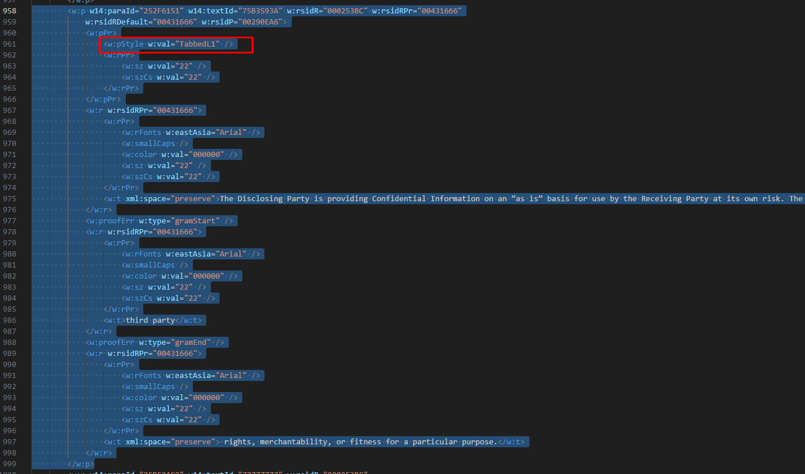

# 🧪 YellowPad Coding Challenge: Smart Clause Insertion in MS Word By Leon Li

## 📌 Overview
This exercise simulates a core challenge from our MS Word Add-in: **intelligently inserting legal language into the correct place in a few Word documents, with the correct formatting**. Your goal is to:

- Identify where a clause should go in each contract
- Fore each contract, insert the clause with the correct font, size, spacing, and formatting
- Handle edge cases like headings, numbering, and placement before/after other sections

## 🏹 How I solved

### Input Data:
- A few sample contracts in `.docx` format (provided in the repo)
- A few snippets of text (a new clause to insert)
- An few instructions like:

> _“Insert this clause as section 4.2, directly after the last paragraph in section 4.1. If a heading is needed, format it bold and underlined, and match the document’s style.”_

### Technical Approach:
1. Parse the instructions and snippets of text document and converted to command object.
   ```json
   Here is the formatted result. Since the paragraph to be inserted depends on the next paragraph format, don't need to add to the instruction data. The section to be inserted will be automatically formatted with document style (implemented in codebase).

   - When insert_type is "as", it means that the text will be inserted as a section.
   - When insert_type is "in", the text will be inserted inside of a section. This means that the sentence will be inserted between first and second sentence
   - sentence_after value is used when the insert_type is "in"

   [
      {
         "contract": "Contract 1",
         "insert_type": "as",
         "section_name": "1A",
         "sentence_after": "None",
         "text": "“Affiliate” means any entity ..."
      },
      {
         "contract": "Contract 2",
         "insert_type": "in",
         "section_name": "11",
         "sentence_after": 1,
         "text": "The Disclosing Party makes ..."
      },
      {
         "contract": "Contract 3",
         "insert_type": "as",
         "section_name": "11",
         "sentence_after": "None",
         "text": "Residuals.  Nothing in this Agreement ..."
      }
   ]
   ```
2. Normalize the paragraph of Word document - some contracts like `Contract 3.docx` does not have the standard numbering and bullets format, numbers are manully edited. So removed numbers from text and then added Word numbering.

3. Insert the text into the correct order.
4. Save updated document in `updated` directory


## 💻 Tech Notes
- Used **Python** with `python-docx` to parse document and manipulated using XML attributes.
- Used **Regular Expressions** for parsing the instructions.

## 🔎 Technical Challenges

#### I decided to go with `python-docx` because it has rich functionalities and have flexible interface to configure XML of Word document. Unfortunately, JavaScript libraries which supports Word manipulation functionality does not have rich interface to handle XML attributes.

#### The styles like `font size`, `font family`, `text indent`, `numbering`, `bullets` ... are only able to configure using XML attribute.

The main challenge I have face was that contract document have different XML structures.
   - Contract 1 have no challenge as it has standard format
   - **Regarding Contract 2**, I had to insert text between first and second sentence of Section 11.
      - **Issue 1**: The paragraph does not have numbering attribute, so the code didn't recognized it as section. As shown in the screenshot, the numbering attribute is set in `TabbedL1` named style, so I added use-case when parsing the docx.
      
      - **Issue 2**: When inserting between first and second sentence in the section, to keep the document formatting, found the correct place in the paragraph and added it in the existing `run`
   - **Regarding Contract 3**, This document is not well-organized. The document default font is `Arial` but all the sections are configured using `Calibri`. So created a function that copies all the paragraph formats and styles from next paragraph.

## How to run the project

```bash
python -m venv venv
source venv/bin/activate # or .\venv\Scripts\activate on Windows
pip install -r requirements.txt

python main.py
```

## ✉️ Conclusion

